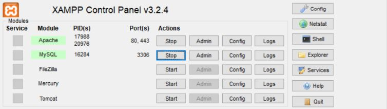
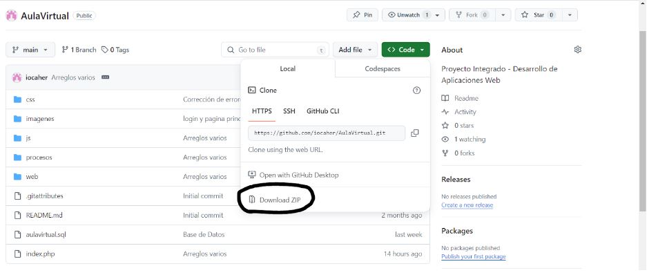
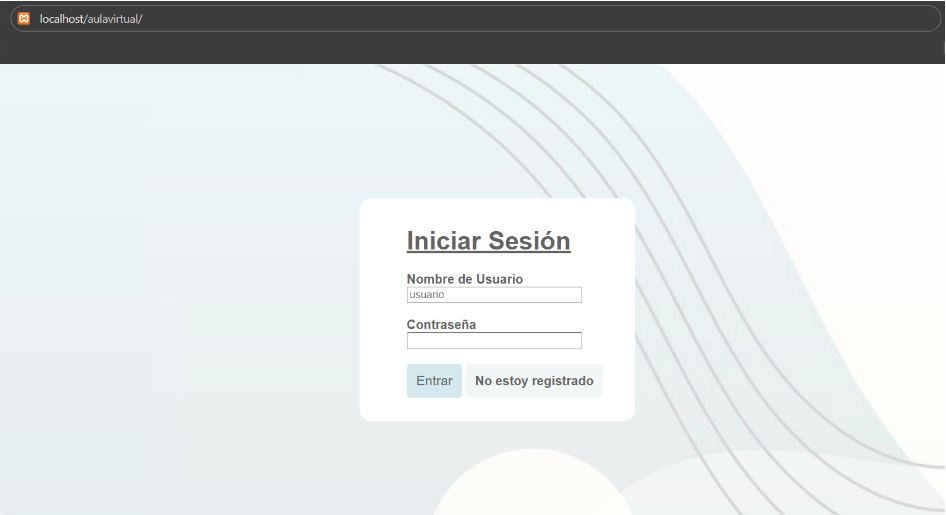
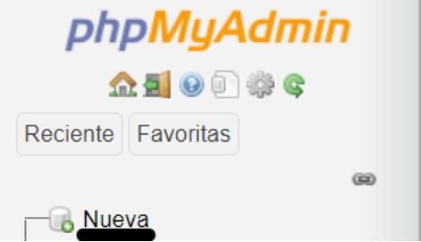
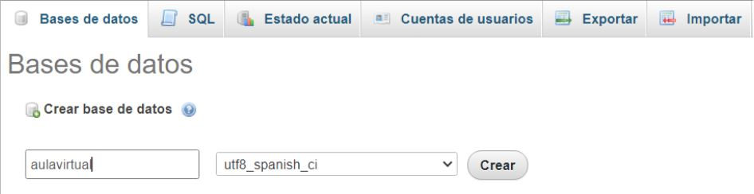
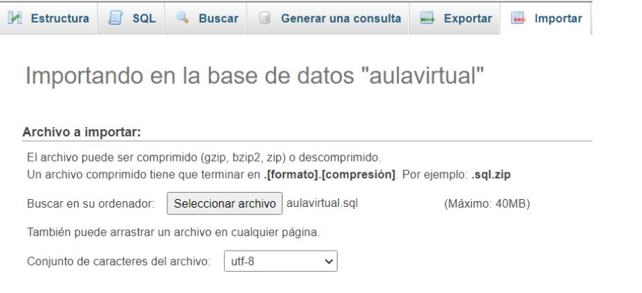
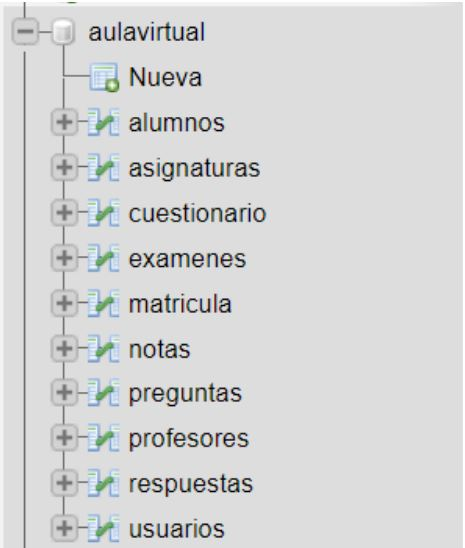

# AulaVirtual
 Proyecto Integrado - Desarrollo de Aplicaciones Web

Para la instalación de nuestra aplicación en un entorno de windows en modo local para su despliegue de pruebas (por ejemplo, para la corrección de errores y para presentar en un entorno de pruebas) vamos a necesitar un par de aplicaciones y pasos a realizar.
Vamos a necesitar, en concreto:

1. XAMPP.
2. Un navegador web.
3. GitHub/GitHub desktop.

Para empezar, descargamos XAMPP y lo instalamos en nuestro ordenador. Nos creará una carpeta en nuestro disco que contendrá todos los módulos y plugins necesarios para su funcionamiento general. A nosotros nos interesa la función de su servidor apache y su SGBD.

Al ejecutar XAMPP en nuestro ordenador, se nos abrirá el panel de control de la aplicación. En este panel de control seleccionaremos las dos primeras opciones, que son el módulo del servidor apache y el de MySQL, para permitir ambas funcionalidades y poder trabajar para ambas.

Una vez hemos dejado preparado nuestro servidor y base de datos, nos dirigiremos al botón que dice Explorer en el panel de control, que nos llevará hasta la carpeta general de xampp en nuestro ordenador. Nuestra aplicación se encontrará en la carpeta htdocs, que se encarga de la gestión de los servicios web del servidor apache.
Para que nuestra aplicación funcione, descargamos el archivo de nuestro repositorio, que se encuentra en GitHub. Podemos utilizar la función de clonado desde github Desktop o descargar directamente el zip desde la web. Para ahorrarnos tiempo, vamos a descargarlo desde la web de esta forma:

Descomprimimos nuestro archivo en la carpeta de htdocs y renombramos la carpeta resultante a AulaVirtual. Aquí dentro se encontrará nuestra aplicación web a la que podemos acceder desde nuestro navegador utilizando la URL de localhost/AulaVirtual. Localhost es nuestro servidor apache y AulaVirtual la carpeta que se encuentra dentro de nuestra carpeta htdocs.

Lo siguiente a configurar será la base de datos, la cual tenemos en nuestra carpeta de AulaVirtual como aulavirtual.sql.
Este archivo nos servirá para importar toda la base de datos con sus triggers incluidos.
Para importar esta base de datos pondremos en nuestro navegador en la url: localhost/phpmyadmin.
Nos aparecerá la página principal de phpMyAdmin, pero nos dirigiremos a la lista de bases de datos ya creadas predeterminadas y nos situaremos en el botón de Nueva, que nos servirá para crear la base de datos donde importamos la base de datos.

Dentro de la nueva ventana que se nos abre, tenemos que rellenar el campo del nombre que tendrá nuestra base de datos (aulavirtual) y el idioma de los caracteres, que usaremos utf8_spanish_ci. Le daremos a crear.

Se nos habrá creado nuestra base de datos sin ninguna tabla y vacía. Ahora lo que tocará será importar nuestras tablas de la base de datos. En la imagen anterior podemos ver el botón de Importar. Situados en nuestra base de datos, le damos al botón de importar, que nos abrirá la siguiente ventana en la aplicación:

Seleccionamos nuestro archivo y dejamos las demás configuraciones tal cual, dándole a continuar para que nuestra base de datos esté completamente importada en nuestra base de datos, lista para usarse en la web.
Con esta configuración tenemos preparada nuestra aplicación totalmente para su puesta en funcionamiento en local con el servidor XAMPP en Windows.

